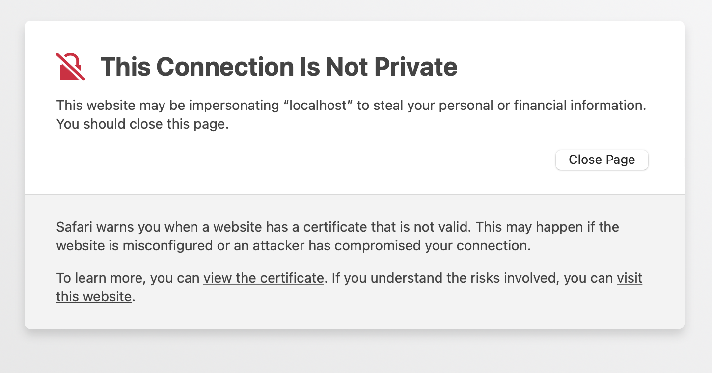

# Cluster set up

This page covers how you get set up on the GenomeDK cluster to do your project. 

First log in to the cluster:

```txt{.bash filename="Terminal"}
ssh <cluster user name>@login.genome.au.dk
```

## The project folder

The project folder is a folder that is set up on the cluster to hold your project. I use the placeholder `<projectfolder>` here, but it will be called something sensible like `baboonadmixture`.

It is accessible to only you and anyone else you collaborate with (such as your supervisor). The project folder is in your home directory and should hold the following subfolders:

```txt
<projectfolder>
    /data
    /people
        /<username>
        /<supervisor_username>
```

The `<projectfolder>/people/<username>` is your domain. This is where you have all the files that relates to your project.

The name of the project folder is is also the name of the account that gets billed for the work on the cluster. When you run `gwf`, `srun`, `sbatch` or `slurm-jupyter` (see below) you must specify that project name using the `-A` or `--account` options (see below for more details on that). 

## Make a Git repository for your project


[Git](https://git-scm.com/) is a version control tool that you use from the terminal. A folder under Git control is called a repository. Git does not interfere with your files and it does not save them. It lets you monitor the state of your files so you can easily see if any files are added, modified, or removed, and it allows you to (manually) maintain a record of what files where changes when, how, and for what reason. 

1. Start by creating your own [github account](https://github.com/join) if you do not have one already.
2. Follow the instructions [on this page](https://www.inmotionhosting.com/support/server/ssh/how-to-add-ssh-keys-to-your-github-account/) to add ssh keys to GitHub.
3. Email me your GitHub username on so I can add you to the shared GitHub account for our research group. I will create a repository for you with scaffold of folders and with placeholder files that will get you started in the right way.
4. Wait for an email or notification and accept my inviation to the "munch-lab" GitHub organization and an email from me with the name of the repository I made for your project. On these pages, I will use `<repositoryname>` for the name of your repository.
5. Make sure you are logged into your GitHub account and then go to the repository listing at the [munch-lab organization](https://github.com/orgs/munch-lab/repositories) on GitHub. Find the directory I made for you and have a look at what is in there. Leave it there for now.

### Cloning this git repository to the cluster

Start logging into the cluster and run these two commands to let Git know who you are:

```{.bash filename="Terminal"}
git config --global user.name "<Your GitHub user name>"
git config --global user.email <your_email@whatever.com>
```

Go to your folder under the project folder (`~/<projectfolder>/people/<username>`). Once you are in that folder, you can "clone" your git repository from GitHub to the folder on the cluster.

```{.bash filename="Terminal"}
git clone git@github.com:munch-lab/<repositoryname>.git
```
(replace `<repositoryname>` with the actual name of your repository).

You now have a folder called `<projectfolder>/people/<username>/<repositoryname>` and this is where you must keep *all* your files for the project.

If you `cd` into `<repositoryname>` and run `ls`, you will see a number of folders.

- `data`: Stores *small* (tens of megabases) data files you want to keep .
- `sandbox`: Stores experiment and other files that are not yet part of your project workflow. This keeps the rest of the folder structure clean.
- `scripts`: Stores Python scripts that that produces intermediate and final results.
- `steps`: Stores intermediary files ("steps" on the way to final results).
- `notebooks`: Stores Juptyer notebooks with code, documentation, and results.
- `figures`: Stores result plots and figures you make.
- `results`: Stores the small result files of your project (tens of megabases).
- `reports`: Stores documents reporting your findings.

Files in all those folders are under Git control, *except* files in the `steps` folder. Those files are not backed up in any way, but should instead be reproducible using the code and information in your other folders.

::: {.callout-important}
## Warning: Files on the cluster are not backed up!

Your files on the cluster are not backed up! If you want to backup files, you need to put them in a folder called BACKUP. But even if you do you may loose a week of work, since the backup loop is very slow. 
:::

The best way to keep your progress safe, is to ensure is reproducible and pushed to GitHub as often as it makes sense (at least onece a day). The more often you do it, the less work you will loose if you accidentally delete or overwrite a file. More about that in @sec-reproducible-reserach and @sec-git-101.

## The Pixi environment


### How to run a Jupyter notebook on the cluster

Jupyter runs best in the [Chrome browser](https://www.google.com/chrome) or Safari on Mac. For the best experience, install that before you go on. It does not need to be your default browser. `slurm-jupyter` will use it anyway. Now make sure you are on your own machine and that your `popgen` environment is activated. Then run this command to start a jupyter notebook on the cluster and send the display to your browser:

```{.bash filename="Terminal"}
slurm-jupyter -u <cluster_user_name> -A <projectfolder<> -e birc-project --chrome
```

(replace `<cluster_user_name>` with your cluster user name, `<projectfolder>` with your project folder name).

Watch the terminal to see what is going on. After a while, a jupyter notebook should show up in your browser window. The first time you do this, your browser may refuse to show jupyter because the connection is unsafe. In Safari you are prompted with this winidow where you click "details":


Then you get this window and click "visit this website":



In Chrome, you can simply type the characters "thisisunsafe" while in the Chrome window:


Once ready, jupyter may ask for your cluster password. To close the jupyter notebook, press `Ctrl-c` in the terminal. Closing the browser window does **not** close down the jupyter on the cluster. You can [read this tutorial](https://www.dataquest.io/blog/jupyter-notebook-tutorial/) to learn how to use a jupyter notebook.

### Visual Studio Code


You should install Visual Studio Code. VScode is great for developing scripts and editing text files. Once you have installed VScode, you should install the "Remote Development" extension. You do that by clicking the funny squares in the left bar and search for "Remote Development". Once installed, you can click the small green square in the lower-left corner to connect to the cluster. Select "Connect current window to host" then "Add new SSH host", then type `<username>@login.genome.au.dk`, then select the config file `.ssh/config`. Now you can click the small green square in the lower-left corner to connect to the cluster by selecting `login.genome.au.dk`. It may take a bit, but once it is done installing a remote server, you will have access to the files in your home folder on the cluster.

### Running interactive commands on the cluster

When you log into the cluster, you land on the "front-end" of the cluster. Think of it as the lobby of a giant hotel. If you execute the `hostname` command, you will get `fe-open-01`. `fe1` is the name of the front-end machine. The "front-end" is a single machine shared by anyone who logs in. So you cannot run resource-intensive jobs there, but quick commands are ok. Commands that finish in less than ten seconds are ok. In the exercises for this course, you will run software that takes a much longer time to finish. So you need one of the computing machines on the cluster, so you can work on that instead. You ask for a computing machine by running this command:

```{.bash filename="Terminal"}
srun --mem-per-cpu=1g --time=3:00:00 --account=<projectfolder> --pty bash
```

That says that you need at most one gigabyte of memory, that you need it for at most three hours (the duration of the exercise), and that the computing expenses should be billed to the project `<projectfolder>`. When you execute the command, your terminal will say "srun: job 40924828 queued and waiting for resources". That means that you are waiting for a machine. Once it prints "srun: job 40924828 has been allocated resources", you have been logged into a computing node. If you execute the `hostname` command, you will get something like `s05n20`. `s05n20` is a computing machine. The same way you moved from your own computer to front-end machine of the cluster by logging in using ssh, the command above moves you from the front-end to a compute machine. Now you can execute any command you like without causing trouble for anyone.

Now try to log out of the compute node by executing the `exit` command or by pressing `Ctrl-d`. If you execute the `hostname` command again, you will get `fe1.genomedk.net` showing that you are back at the front-end machine.

### Queueing commands on the cluster

For non-interactive work, it is better to submit your command as a job to the cluster. When you do that, the job gets queued along with many other jobs, and as soon as the requested resources are available on the cluster, the job will start on one the many many machines. To submit a job, you must first create a file (a "batch script") that contains both the requested computer resources and the command you want to run. 

Create a file called `myscript.sh` with exactly this content:

```txt
#!/bin/bash
#SBATCH --mem=1gb
#SBATCH --time=01:00:00
#SBATCH --account=<projectfolder>
#SBATCH --job-name=firstjob

echo "I can submit cluster jobs now!" > success.txt
```

(replace `<projectfolder>` with your project folder name)

The first line says this is a bash script, the lines following three lines say that your job needs at most one gigabyte of memory, will run for at most one hour, that the expenses should be billed to the project `<projectfolder>`. The fourth line gives the name of the job. Here we have called it `firstjob`, but you should name it something sensible. 

You submit the job using the `sbatch` command: 

```{.bash filename="Terminal"}
sbatch myscript.sh
```

Now your job is queued. Use the `mj` command to see what jobs you have queued or running. That will show something like this:

```txt
                                                                        Alloc
Job ID           Username Queue    Jobname    SessID NDS  S Elap Time   nodes
---------------- -------- -------- ---------- ------ ---  - ----------  -----
34745986         kmt      normal   firstjob       --   1  R 0-00:19:27  s03n56
```

If you want to cancel this job before it finishes, you can use the `scancel` command:

```{.bash filename="Terminal"}
scancel 34745986
```

Once your job finishes, it has created the file `success.txt` and written "I can submit cluster jobs now!" to it. So see that you can use the `cat` command:

```{.bash filename="Terminal"}
cat success.txt
```

When you a program or script on the command line, it usually also prints some information in the terminal. When you run a job on the cluster there is no terminal to print to. Instead, this is written to two files that you can read when the job finishes. In this case, the fiels are called `firstjob.stdout` and `firstjob.stderr`. To see what is in them, you can use the `cat` command:

```{.bash filename="Terminal"}
cat firstjob.stdout
```

and

```{.bash filename="Terminal"}
cat firstjob.stderr
```

That is basically it. 

### How to copy files to and from the cluster

You may need to transfer files back and forth between your own machine and the cluster. To copy a file called `file` in a directory called `dir` on the cluster to the current folder on your own machine, you can use the `scp` command:

```{.bash filename="Terminal"}
scp <cluster_user_name>@login.genome.au.dk:dir/file .
```

To copy a file called `file` in the current folder on your own machine to a folder called `dir` on the cluster, you do this:

```{.bash filename="Terminal"}
scp ./file <cluster_user_name>@login.genome.au.dk:dir/
```


